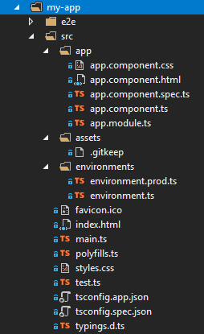

The [Angular CLI](https://cli.angular.io/) is a command line interface tool that can create a project, add files, and perform a variety of ongoing development tasks such as testing, bundling, and deployment.

Adhere to [Style Guide](https://angular.io/guide/styleguide) recommendations.

Make sure you are running the latest node and npm. Check the version:
```
node -v
```

```
npm -v
```

# Get Start
Install Angular CLI:
```
npm install -g @angular/cli```
Make sure your current user has the access to modify npm node_modules:
```
sudo chown -R your_user /usr/local
```
This will five the current user the write access to the local path where npm is
using to install global packages.

Find more: https://docs.npmjs.com/getting-started/fixing-npm-permissions

## Create a new project
Run the following command to generate a new project and skeleton application:
```
ng new my-app
```
Launch the server to start the app.
```
cd my-app
ng serve --open
```
The `ng serve` command launches the server, watches your files, and rebuilds the app as you make changes to those files.

Using the `--open` (or just `-o`) option will automatically open your browser on http://localhost:4200/.

Navigate to **my-app/src/app** in order to explore the component and app.



- Your app lives in the src folder. All Angular components, templates, styles, images, and anything else your app needs go here. Any files outside of this folder are meant to support building your app.

- `main.ts` is the main entry point for your app. Compiles the application with the JIT compiler and bootstraps the application's root module (AppModule) to run in the browser. You can also use the AOT compiler without changing any code by passing in --aot to ng build or ng serve.
- `tsconfig.{app|spec}.json` TypeScript compiler configuration for the Angular app (tsconfig.app.json) and for the unit tests (tsconfig.spec.json).
